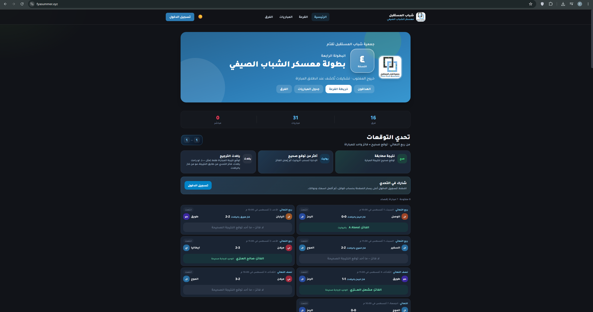
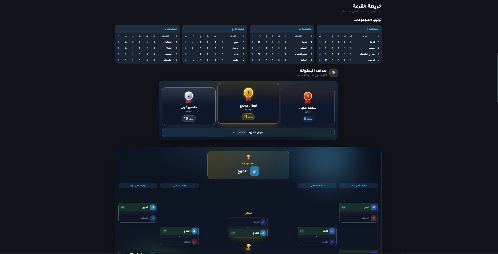
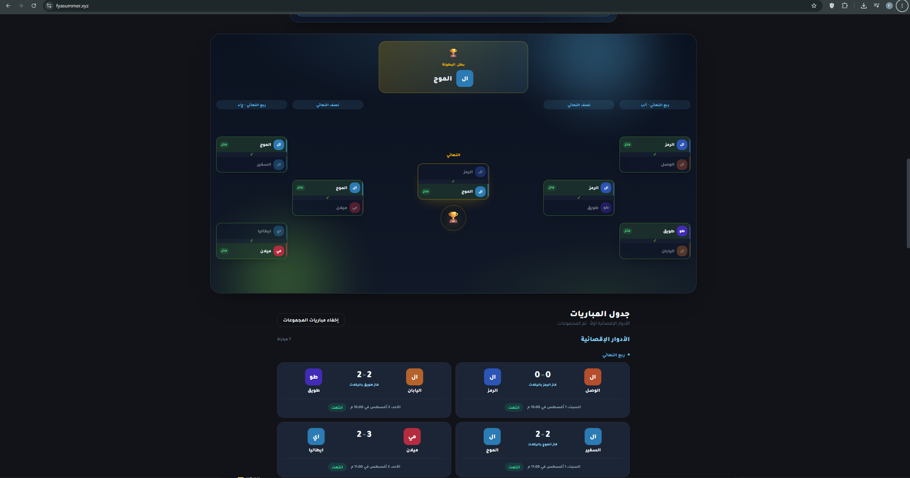
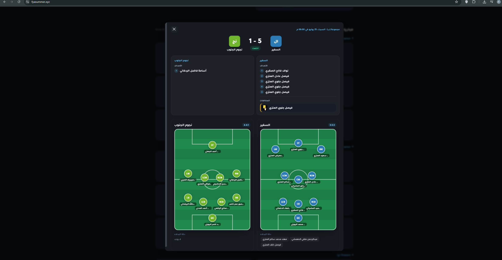
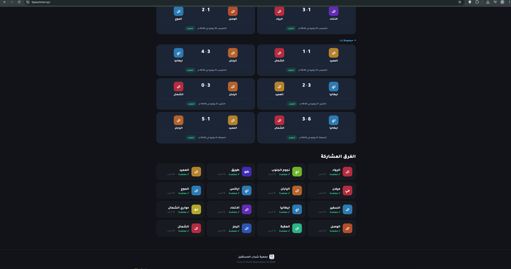
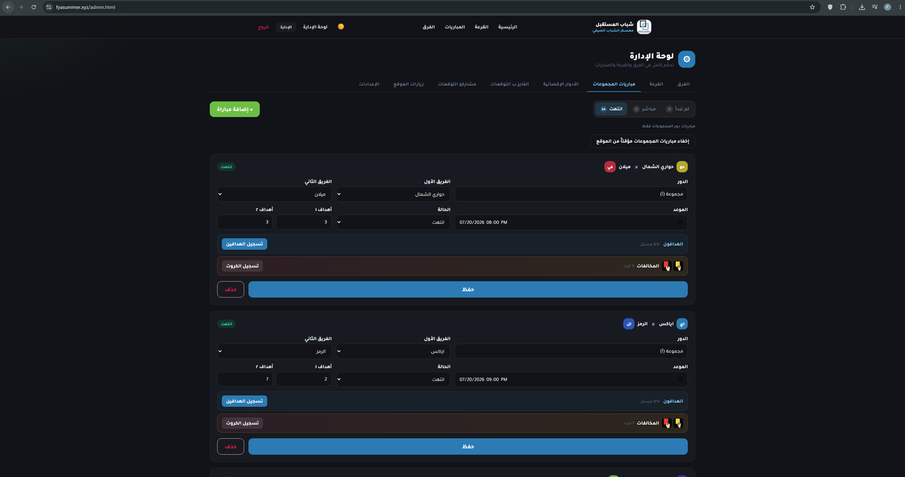

# Future Youth Championship

**Completed project** — Full tournament web platform for the Future Youth Association summer championship (4th edition).

> Source code is private. This repository is a **portfolio showcase** with screenshots and project details only.  
> No live demo link is included (temporary deployment).

---

## Impact

| Metric | Result |
|--------|--------|
| Site visits | **300** |
| Predictions submitted | **69** |
| Prediction winners | **3** |
| Teams | **16** |
| Matches managed | **31** |

---

## Overview

Built an end-to-end web application to run a real youth football championship:

- Public pages for standings, matches, teams, draw map, and top scorers
- Google Sign-In prediction challenge
- Match details with scorers, cards, and pitch formations
- Full admin panel to manage teams, draw, matches, predictions, and visits

---

## My Role

- Frontend pages and interactive UI (dark theme, Arabic RTL)
- Backend APIs with Node.js / Express
- Authentication (JWT + Google OAuth)
- SQLite data storage
- Match/events tracking (goals, cards, formations)
- Deployment and HTTPS setup

---

## Features

- Tournament homepage with live counters
- Prediction challenge with winners tracking
- Group standings (A–D) and knockout bracket
- Match schedule (group stage + knockout)
- Match details: scorers, cards, pitch formations
- Teams directory (16 confirmed teams)
- Admin CRUD for matches, scorers, and cards
- Site visit analytics

---

## Tech Stack

| Area | Technologies |
|------|----------------|
| Frontend | HTML, CSS, JavaScript |
| Backend | Node.js, Express |
| Database | SQLite |
| Auth | JWT, Google OAuth |
| Other | Discord notifications, HTTPS |

---

## Screenshots

### 1 — Home & Predictions

### 2 — Standings & Top Scorers

### 3 — Bracket & Knockout Matches

### 4 — Match Details & Formations

### 5 — Participating Teams

### 6 — Admin Panel

